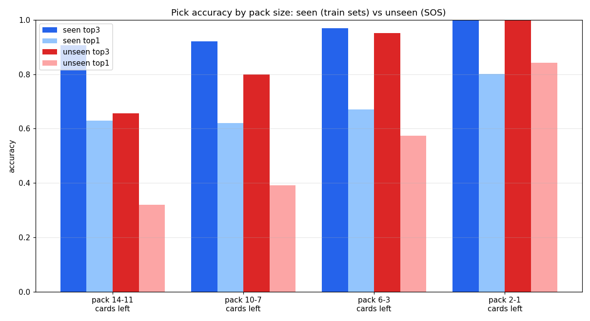

# MTG Draft Assistant

Given the cards in a booster pack and the cards you have already picked, this model
ranks which card to take next. It generalizes to **unseen sets**: a card it has never
seen still gets a vector from its features for zero-shot inference.

The model was trained on draft data from 30 different sets from 17Lands, keeping only drafts from players who achieved a 55% win rate, reached at least Platinum rank, and scored at least 5 wins with the drafted deck. It was validated on zero-shot inference using the latest Secrets of Strixhaven (SOS) set.

## Metrics

Pick accuracy by how many cards are left in the pack, on a **seen** set (in training)
and on the **unseen** SOS set (zero-shot):



## Install

```bash
pip install -r requirements.txt
```

The SBERT model (`all-MiniLM-L6-v2`) is downloaded automatically on first use.

## Usage

### Statefull API

```python
from inference import MtgDraftAssistant

asst = MtgDraftAssistant.from_pretrained()

d = asst.new_draft() # fresh new stateful draft context
d.see(["Lightning Bolt", "Llanowar Elves", "Cancel"])   # see pack 1 (inference)
d.pick("Lightning Bolt")                                 # take a card

for name, prob in d.see(["Shock", "Giant Growth", "Murder"]):
    print(f"{prob:.1%}  {name}")
```

### Stateless API

```python
asst.rank(
    pack_history=[                       # one pack per step, current pack last
        ["Lightning Bolt", "Cancel"],
        ["Shock", "Giant Growth"],
    ],
    pool=["Lightning Bolt"],             # cards already picked
)
# -> [("Shock", 0.94), ("Giant Growth", 0.06)]
```

### Unseen / custom cards

Cards are passed as **names** (resolved via the bundled card database) or as
**Scryfall-style dicts** (used directly works for custom, spoiler, or yet to be released cards):

```python
custom = {
    "name": "Made-Up Card",
    "type_line": "Creature - Goblin",
    "mana_cost": "{1}{R}",
    "power": "3", "toughness": "1",
    "oracle_text": "Haste. When it enters, it deals 2 damage to any target.",
}
asst.rank([[custom, "Giant Growth", "Cancel"]], pool=[])
```

## How it works

- **Featurizer** (`featurizer/`) - turns a card into a 255-d vector
  (PCA of SBERT text embedding + numeric features + 207 regex flags). The card type is
  prepended to the oracle text before SBERT. Assets: `sbert_pca.joblib`, `patterns/`,
  `cards.json`.
- **Model** (`model.py`) - 3.67M params encoder-decoder transformer: the encoder pools the pack
  history, the decoder cross-attends the picked-card history (your current deck), and a head
  scores each candidate.